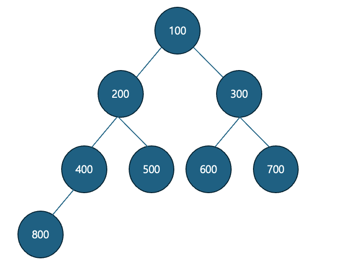

# 이진 트리 구현

이진 트리를 java 코드로 구현해 보았다.
https://github.com/NotHyoone/JAVASTUDY/blob/master/study/java_study/C01_BinaryTree.java

--------------------------------
- 이진트리가 아래와 같은 그림으로 구성

--------------------------------

## 순회

1. 전위 순회
루트 노드를 먼저 방문하고, 왼쪽 자식 트리를 전위 순회하고, 오른쪽 자식 트리를 전위 순회
NLR (Node, Left, Right) : 루트-왼쪽-오른쪽 순서
100 - 200 - 400 - 800 - 500 - 300 - 600 - 700

--------------------------------

2. 중위 순회
왼쪽 자식 트리를 중위 순회하고, 루트 노드를 방문하고, 오른쪽 자식 트리를 중위 순회
LNR (Left, Node, Right) : 왼쪽-루트-오른쪽 순서
800 - 400 - 200 - 500 - 100 - 600 - 300 - 700

--------------------------------

3. 후위 순회
왼쪽 자식 트리를 후위 순회하고, 오른쪽 자식 트리를 후위 순회하고, 루트 노드를 방문
LRN (Left, Right, Node) : 왼쪽-오른쪽-루트 순서
800 - 400 - 500 - 200 - 600 - 700 - 300 - 100

--------------------------------

4. 레벨 순회
트리를 레벨별로 순회. 각 레벨의 노드를 왼쪽에서 오른쪽으로 방문
BFS (Breadth-First Search) 이다.
100 - 200 - 300 - 400 - 500 - 600 - 700 - 800

--------------------------------

- Queue의 poll() 메서드
poll() 메서드 사용하면 Queue의 최상위 요소(헤드)를 검색하고 제거할 수 있다.

