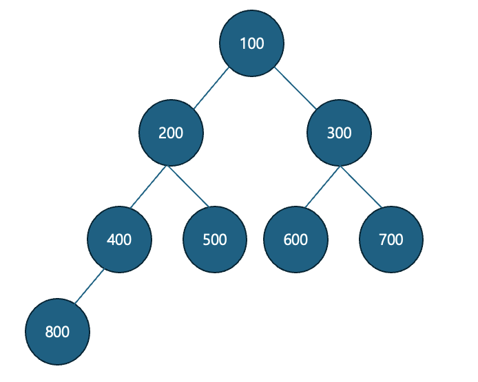

# 이진 트리 구현 (2025.07.28)

> 이진 트리를 Java 코드로 구현
> [소스코드 보기](https://github.com/NotHyoone/JAVASTUDY/blob/master/study/java_study/C01_BinaryTree.java)



---

## 순회 방법

### 1. 전위 순회 (Pre-order, NLR)
루트 → 왼쪽 → 오른쪽

```
100 - 200 - 400 - 800 - 500 - 300 - 600 - 700
```

### 2. 중위 순회 (In-order, LNR)
왼쪽 → 루트 → 오른쪽

```
800 - 400 - 200 - 500 - 100 - 600 - 300 - 700
```

### 3. 후위 순회 (Post-order, LRN)
왼쪽 → 오른쪽 → 루트

```
800 - 400 - 500 - 200 - 600 - 700 - 300 - 100
```

### 4. 레벨 순회 (Level-order, BFS)
트리를 레벨별로 왼쪽 → 오른쪽 순서로 방문

```
100 - 200 - 300 - 400 - 500 - 600 - 700 - 800
```

---

## Queue — poll() 메서드

- `poll()` — Queue의 **헤드(최상위 요소)를 꺼내고 제거**
- 레벨 순회(BFS) 구현 시 주로 활용

