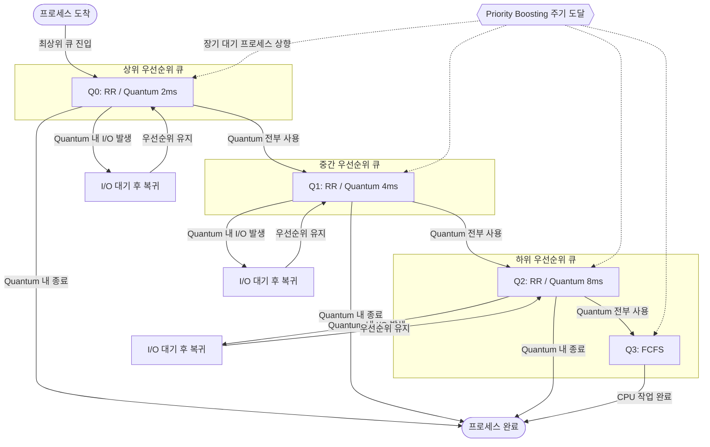

```mermaid
gantt
	title HRRN Gantt Chart
	dateFormat X
	axisFormat t=%L
	section CPU
	P1 :h1, 0, 10
	P4 :h2, 10, 4
	P3 :h3, 14, 6
	P2 :h4, 20, 28
```

# 1. First-Come, First-Served (FCFS) 

## Pseudo Code

```python
# FCFS 스케줄링 알고리즘 예시
def fcfs_scheduler(processes):
    # 프로세스는 도착 순서대로 정렬되어 있다고 가정
    now = 0
    for p in processes:
        if now < p.arrival_time:
            now = p.arrival_time  # CPU가 유휴 상태인 경우, 프로세스 도착 시간까지 대기
        run_process(p)  # 프로세스 실행
        now += p.burst_time  # 현재 시간 업데이트
```

## 설명

First-Come, First-Served (FCFS) 스케줄링 알고리즘은 가장 간단한 형태의 스케줄링 알고리즘으로, 프로세스가 도착한 순서대로 CPU를 할당하는 방식입니다. 동시에 도착했다면 누가 먼저 도착했는지에 따라 처리 순서가 결정됩니다. 이 알고리즘은 비선점형 정책을 사용합니다.

## Case Study

| Process | Arrival Time | Burst Time |
|---------|-------------|------------|
| P1      | 0           | 15         |
| P2      | 0           | 7          |
| P3      | 0           | 11         |
| P4      | 0           | 20         |

> 모든 프로세스가 t=0에 동시 도착. 동착 시 tie-break는 등록(입력) 순서이며, 이 예제에서는 P3 → P4 → P1 → P2 순으로 등록되었다.

```mermaid
gantt
	title FCFS Gantt Chart (All Arrive at t=0)
	dateFormat X
	axisFormat t=%L
	section CPU
	P3 :f1, 0, 11
	P4 :f2, 11, 20
	P1 :f3, 31, 15
	P2 :f4, 46, 7
```



## 사례 설명 및 분석

이 간트차트는 FCFS 스케줄링 알고리즘에서 네 개의 프로세스가 모두 t=0에 도착하여 CPU를 할당받아 실행되는 과정을 보여줍니다. 비선점형 정책이므로 한 번 CPU를 점유한 프로세스는 자신의 버스트 타임이 끝날 때까지 실행됩니다.

**실행 흐름**

| 구간  | 실행 프로세스 | 사유                          |
|-------|------------|------------------------------|
| 0~11  | P3         | 등록 순서 1번 (burst=11)       |
| 11~31 | P4         | 등록 순서 2번 (burst=20)       |
| 31~46 | P1         | 등록 순서 3번 (burst=15)       |
| 46~53 | P2         | 등록 순서 4번 (burst=7)        |

**결과 요약**

| Process | Burst | 완료 시간 | 반환 시간 (TAT) | 대기 시간 |
|---------|-------|---------|---------------|----------|
| P3      | 11    | 11      | 11            | 0        |
| P4      | 20    | 31      | 31            | 11       |
| P1      | 15    | 46      | 46            | 31       |
| P2      | 7     | 53      | 53            | 46       |

버스트 타임이 가장 짧은 P2(burst=7)가 가장 마지막에 실행되어 대기 시간이 46ms에 달합니다. 이는 FCFS의 대표적인 문제인 **Convoy Effect**로, 긴 작업들이 앞에 배치되면 짧은 작업들이 뒤에서 길게 대기하게 됩니다. 모든 프로세스의 도착 시간이 같다면 실행 순서가 성능에 결정적인 영향을 미치며, 짧은 작업이 먼저 실행되는 케이스(P2→P3→P1→P4)가 최적이고, 긴 작업이 먼저 실행되는 케이스(P4→P1→P3→P2)가 최악입니다.

## 특징

- 특정 알고리즘별 개별 입력 요소: `arrival time`, `CPU burst time`, 동시 도착 시 tie-break 기준(예: 입력 순서)이 필요합니다.
- 독특한 동작 방식 혹은 현상: 도착 순서대로 비선점 실행되므로 긴 작업이 앞에 오면 뒤의 짧은 작업들이 함께 지연되는 Convoy Effect가 발생할 수 있습니다.
- 구현 시, 특징적 고려사항 등: 준비 큐를 도착 순으로 안정 정렬해야 하며, CPU 유휴 시 현재 시간을 다음 도착 시각으로 점프시키는 처리가 필요합니다.


## 장점

- 구현이 매우 간단하며, 이해하기 쉽습니다.
- 프로세스가 도착한 순서대로 처리되므로 공정한 스케줄링이 가능합니다.

## 단점

- CPU 바운드 프로세스가 먼저 도착하면, I/O 바운드 프로세스가 긴 시간 동안 대기해야 하는 문제(Convoy Effect)가 발생할 수 있습니다.
- 프로세스의 실행 시간이 길면, 다른 프로세스가 대기하는 시간이 길어질 수 있습니다.

# 2. Shortest Job First (SJF)

## Pseudo Code

```python
# SJF 스케줄링 알고리즘 예시
def sjf_scheduler(processes):
    # 프로세스는 도착 시간과 버스트 타임이 주어졌다고 가정
    now = 0
    while processes:
        # 현재 시간까지 도착한 프로세스 중에서 버스트 타임이 가장 짧은 프로세스 선택
        available_processes = [p for p in processes if p.arrival_time <= now]
        if not available_processes:
            now += 1  # CPU가 유휴 상태인 경우, 다음 시간으로 이동
            continue
        next_process = min(available_processes, key=lambda p: p.burst_time)
        run_process(next_process)  # 프로세스 실행
        now += next_process.burst_time  # 현재 시간 업데이트
        processes.remove(next_process)  # 실행된 프로세스 제거
```

## 설명

Shortest Job First (SJF) 스케줄링 알고리즘은 현재 시간까지 도착한 프로세스 중에서 버스트 타임이 가장 짧은 프로세스를 선택하여 CPU를 할당하는 방식입니다. 이 알고리즘은 비선점형 정책을 사용합니다.

## Case Study

| Process | Arrival Time | Burst Time |
|---------|-------------|------------|
| P1      | 0           | 10         |
| P2      | 4           | 13         |
| P3      | 8           | 7          |
| P4      | 10          | 5          |

```mermaid
gantt
	title SJF (Non-preemptive) Gantt Chart
	dateFormat X
	axisFormat t=%L
	section CPU
	P1 :s1, 0, 10
	P4 :s2, 10, 5
	P3 :s3, 15, 7
	P2 :s4, 22, 13
```



## 사례 설명 및 분석

이 간트차트는 SJF 스케줄링 알고리즘에서 네 개의 프로세스가 도착 시간과 버스트 타임에 따라 CPU를 할당받아 실행되는 과정을 보여줍니다.

**실행 흐름**

- **t=0**: P1만 도착해 있으므로 P1(burst=10)이 실행됩니다.
- **t=10**: P1 완료. 현재 도착한 프로세스: P2(arr=4, burst=13), P3(arr=8, burst=7), P4(arr=10, burst=5). SJF는 가장 짧은 P4(burst=5)를 선택합니다.
- **t=15**: P4 완료. 남은 P2(burst=13), P3(burst=7). P3(burst=7)이 더 짧으므로 P3을 선택합니다.
- **t=22**: P3 완료. P2(burst=13)만 남아 실행됩니다.

**결과 요약**

| Process | Arrival | Burst | 완료 시간 | 반환 시간 (TAT) | 대기 시간 |
|---------|---------|-------|---------|---------------|----------|
| P1      | 0       | 10    | 10      | 10            | 0        |
| P4      | 10      | 5     | 15      | 5             | 0        |
| P3      | 8       | 7     | 22      | 14            | 7        |
| P2      | 4       | 13    | 35      | 31            | 18       |

P4는 도착과 동시에 CPU를 할당받아 대기 시간이 0입니다. 반면 가장 긴 P2(burst=13)는 짧은 작업들이 모두 소진된 후에야 실행되어 대기 시간(18ms)이 가장 깁니다. 이처럼 SJF는 평균 대기 시간을 줄이는 데 효과적이지만, 긴 작업에 대한 **Starvation** 위험이 존재합니다.

## 특징
- 특정 알고리즘별 개별 입력 요소: `arrival time`, `CPU burst time`이 필수이며, 비선점형 SJF인지 선점형 SRTF인지 정책 정보가 필요합니다.
- 독특한 동작 방식 혹은 현상: 현재 시점에 도착한 작업 중 가장 짧은 버스트를 우선 선택해 평균 대기 시간을 줄이지만, 긴 작업은 기아(Starvation) 위험이 있습니다.
- 구현 시, 특징적 고려사항 등: 버스트 시간 예측 정확도가 성능을 좌우하므로 추정식(예: 지수평활)을 함께 설계하고, 동률 처리 규칙 및 에이징 정책을 두는 것이 좋습니다.

## 장점

- 평균 대기 시간을 최소화할 수 있습니다.
- CPU 바운드 프로세스가 짧은 경우, 빠르게 처리할 수 있습니다.

## 단점

- 프로세스의 버스트 타임을 정확히 예측하기 어렵습니다.
- 긴 버스트 타임을 가진 프로세스가 계속해서 대기하는 문제(Starvation)가 발생할 수 있습니다.

# 3. Shortest Remaining Time First (SRTF)

## Pseudo Code

```python
# SRTF 스케줄링 알고리즘 예시
def srtf_scheduler(processes):
    # 프로세스는 도착 시간과 버스트 타임이 주어졌다고 가정
    now = 0
    while processes:
        # 현재 시간까지 도착한 프로세스 중에서 남은 버스트 타임이 가장 짧은 프로세스 선택
        available_processes = [p for p in processes if p.arrival_time <= now]
        if not available_processes:
            now += 1  # CPU가 유휴 상태인 경우, 다음 시간으로 이동
            continue
        next_process = min(available_processes, key=lambda p: p.remaining_time)
        run_process(next_process)  # 프로세스 실행
        now += next_process.remaining_time  # 현재 시간 업데이트
        processes.remove(next_process)  # 실행된 프로세스 제거
```

## 설명

Shortest Remaining Time First (SRTF) 스케줄링 알고리즘은 현재 시간까지 도착한 프로세스 중에서 남은 버스트 타임이 가장 짧은 프로세스를 선택하여 CPU를 할당하는 방식입니다. 이 알고리즘은 선점형 정책을 사용합니다.

## Case Study

| Process | Arrival Time | Burst Time |
|---------|-------------|------------|
| P1      | 0           | 20         |
| P2      | 3           | 5          |
| P3      | 7           | 11         |
| P4      | 12          | 2          |

```mermaid
gantt
	title SRTF (Preemptive SJF) Gantt Chart
	dateFormat X
	axisFormat t=%L
	section CPU
	P1 :r1, 0, 3
	P2 :r2, 3, 5
	P3 :r3, 8, 4
	P4 :r4, 12, 2
	P3 :r5, 14, 7
	P1 :r6, 21, 17
```



## 사례 설명 및 분석

이 간트차트는 SRTF 스케줄링 알고리즘에서 네 개의 프로세스가 도착 시간과 남은 버스트 타임에 따라 선점이 발생하는 과정을 보여줍니다.

**선점 발생 흐름**

| 시점  | 이벤트                                              | 선점 여부 |
|-------|----------------------------------------------------|---------|
| t=0   | P1(rem=20)만 존재 → P1 실행                          | -       |
| t=3   | P2(burst=5) 도착. P2(5) < P1(rem=17) → **P2가 선점** | 선점 ✓  |
| t=7   | P3(burst=11) 도착. P2(rem=1) < P3(11) → P2 계속    | 유지     |
| t=8   | P2 완료. P1(rem=17), P3(rem=11). P3(11) < P1(17) → P3 실행 | -  |
| t=12  | P4(burst=2) 도착. P4(2) < P3(rem=7) → **P4가 선점** | 선점 ✓  |
| t=14  | P4 완료. P1(rem=17), P3(rem=7). P3(7) < P1(17) → P3 재개 | - |
| t=21  | P3 완료. P1(rem=17)만 남아 실행 → t=38 완료          | -       |

**결과 요약**

| Process | Burst | 완료 시간 | 반환 시간 (TAT) | 대기 시간 |
|---------|-------|---------|---------------|----------|
| P2      | 5     | 8       | 5             | 0        |
| P4      | 2     | 14      | 2             | 0        |
| P3      | 11    | 21      | 14            | 3        |
| P1      | 20    | 38      | 38            | 18       |

SRTF는 총 두 번의 선점(t=3, t=12)이 발생했습니다. 짧은 작업인 P2, P4는 도착 즉시 CPU를 확보해 대기 시간이 0이지만, 가장 긴 P1(burst=20)은 두 번이나 중단되어 대기 시간이 18ms에 달합니다. SRTF는 SJF의 선점형 버전으로 평균 대기 시간 최소화에 최적이지만, P1과 같은 긴 작업의 **Starvation** 위험이 SJF보다 더 큽니다.

## 특징

- 특정 알고리즘별 개별 입력 요소: `arrival time`, `CPU burst time`이 필수이며, 선점형 정책 정보가 필요합니다.
- 독특한 동작 방식 혹은 현상: 새로운 작업이 도착할 때마다 가장 짧은 남은 시간을 가진 작업으로 선점하여 평균 대기 시간을 줄이지만, 긴 작업은 기아(Starvation) 위험이 있습니다.
- 구현 시, 특징적 고려사항 등: 버스트 시간 예측 정확도가 성능을 좌우하므로 추정식(예: 지수평활)을 함께 설계하고, 동률 처리 규칙 및 에이징 정책을 두는 것이 좋습니다.

## 장점

- 평균 대기 시간을 최소화할 수 있습니다.
- 새로운 프로세스가 도착하여 현재 실행 중인 프로세스보다 짧은 버스트 타임을 가지면, 현재 프로세스를 선점하여 새로운 프로세스를 빠르게 처리할 수 있습니다.

## 단점

- 프로세스의 버스트 타임을 정확히 예측하기 어렵습니다.
- 긴 버스트 타임을 가진 프로세스가 계속해서 대기하는 문제(Starvation)가 발생할 수 있습니다.

# 4. Priority Scheduling

## Pseudo Code

```python
# Priority Scheduling 알고리즘 예시
def priority_scheduler(processes):
    # 프로세스는 도착 시간과 우선순위가 주어졌다고 가정
    now = 0
    while processes:
        # 현재 시간까지 도착한 프로세스 중에서 우선순위가 가장 높은 프로세스 선택
        available_processes = [p for p in processes if p.arrival_time <= now]
        if not available_processes:
            now += 1  # CPU가 유휴 상태인 경우, 다음 시간으로 이동
            continue
        next_process = max(available_processes, key=lambda p: p.priority)
        run_process(next_process)  # 프로세스 실행
        now += next_process.burst_time  # 현재 시간 업데이트
        processes.remove(next_process)  # 실행된 프로세스 제거
```

## 설명

Priority Scheduling 알고리즘은 현재 시간까지 도착한 프로세스 중에서 우선순위가 가장 높은 프로세스를 선택하여 CPU를 할당하는 방식입니다. 이 알고리즘은 비선점형 정책을 사용합니다.

## Case Study

| Process | Arrival Time | Burst Time | Priority |
|---------|-------------|------------|----------|
| P1      | 0           | 5          | 4        |
| P2      | 2           | 12         | 1        |
| P3      | 3           | 18         | 3        |
| P4      | 5           | 9          | 2        |

> **Priority 1 = 최고 우선순위** (숫자가 낮을수록 우선순위 높음). 선점형 정책 적용.

```mermaid
gantt
	title Priority Scheduling (Preemptive) Gantt Chart
	dateFormat X
	axisFormat t=%L
	section CPU
	P1 :p1, 0, 2
	P2 :p2, 2, 12
	P4 :p3, 14, 9
	P3 :p4, 23, 18
	P1 :p5, 41, 3
```



## 사례 설명 및 분석

이 간트차트는 선점형 Priority Scheduling 알고리즘에서 네 개의 프로세스가 도착 시간과 우선순위에 따라 CPU를 할당받아 실행되는 과정을 보여줍니다.

**선점 발생 흐름**

| 시점  | 이벤트                                                    | 선점 여부 |
|-------|----------------------------------------------------------|---------|
| t=0   | P1(prio=4)만 존재 → P1 실행                               | -       |
| t=2   | P2(prio=1) 도착. prio 1 < 4 → **P2가 P1 선점** (P1 rem=3) | 선점 ✓  |
| t=3   | P3(prio=3) 도착. P2(prio=1)가 여전히 최고 → P2 계속       | 유지     |
| t=5   | P4(prio=2) 도착. P2(prio=1)가 여전히 최고 → P2 계속       | 유지     |
| t=14  | P2 완료. 대기 중: P1(prio=4), P3(prio=3), P4(prio=2). P4(prio=2) 선택 | -  |
| t=23  | P4 완료. P3(prio=3) > P1(prio=4). P3 실행                 | -       |
| t=41  | P3 완료. P1(rem=3) 실행 → t=44 완료                       | -       |

**결과 요약**

| Process | Priority | Burst | 완료 시간 | 반환 시간 (TAT) | 대기 시간 |
|---------|----------|-------|---------|---------------|----------|
| P2      | 1 (최고)  | 12    | 14      | 12            | 0        |
| P4      | 2        | 9     | 23      | 18            | 9        |
| P3      | 3        | 18    | 41      | 38            | 20       |
| P1      | 4 (최저)  | 5     | 44      | 44            | 39       |

P2는 t=2에 도착하자마자 최고 우선순위(prio=1)로 P1을 선점하여 이후 방해 없이 완료됩니다. 반면 P1은 우선순위가 가장 낮아(prio=4) 선점당한 뒤 다른 모든 프로세스가 끝날 때까지 기다려야 하며, 반환 시간이 44ms로 실제 버스트(5ms)의 거의 9배에 달합니다. 이는 선점형 Priority Scheduling에서 낮은 우선순위 프로세스가 겪는 **Starvation** 문제를 잘 보여줍니다.

## 특징

- 특정 알고리즘별 개별 입력 요소: `arrival time`, `CPU burst time`, `priority`가 필수이며, 비선점형 정책 정보가 필요합니다.
- 독특한 동작 방식 혹은 현상: 우선순위가 높은 작업이 먼저 실행되지만, 낮은 우선순위 작업이 무한 대기 상태에 빠지는 Starvation 문제가 발생할 수 있습니다.
- 구현 시, 특징적 고려사항 등: 우선순위가 동일한 경우의 처리 규칙과 Starvation 완화를 위한 에이징 정책을 설계하는 것이 중요합니다.

## 장점

- 중요한 작업이 빠르게 처리될 수 있습니다.
- 새로운 프로세스가 도착하여 현재 실행 중인 프로세스보다 높은 우선순위를 가지면, 현재 프로세스를 선점하여 새로운 프로세스를 빠르게 처리할 수 있습니다.

## 단점

- 낮은 우선순위 작업이 무한 대기 상태에 빠지는 문제(Starvation)가 발생할 수 있습니다.
- 우선순위가 동일한 경우의 처리 규칙이 필요합니다.

# 5. HRRN (Highest Response Ratio Next)

## Pseudo Code

```python
# HRRN 스케줄링 알고리즘 예시
def hrrn_scheduler(processes):
    # 프로세스는 도착 시간과 버스트 타임이 주어졌다고 가정
    now = 0
    while processes:
        # 현재 시간까지 도착한 프로세스 중에서 응답 비율이 가장 높은 프로세스 선택
        available_processes = [p for p in processes if p.arrival_time <= now]
        if not available_processes:
            now += 1  # CPU가 유휴 상태인 경우, 다음 시간으로 이동
            continue
        next_process = max(available_processes, key=lambda p: (now - p.arrival_time + p.burst_time) / p.burst_time)
        run_process(next_process)  # 프로세스 실행
        now += next_process.burst_time  # 현재 시간 업데이트
        processes.remove(next_process)  # 실행된 프로세스 제거
```

## 설명

HRRN (Highest Response Ratio Next) 스케줄링 알고리즘은 현재 시간까지 도착한 프로세스 중에서 응답 비율이 가장 높은 프로세스를 선택하여 CPU를 할당하는 방식입니다. 응답 비율은 (대기 시간 + 버스트 타임) / 버스트 타임으로 계산됩니다. 이 알고리즘은 비선점형 정책을 사용합니다.

## Case Study

| Process | Arrival Time | Burst Time |
|---------|-------------|------------|
| P1      | 0           | 10         |
| P2      | 1           | 28         |
| P3      | 2           | 6          |
| P4      | 3           | 4          |



## 사례 설명 및 분석

이 간트차트는 HRRN 스케줄링 알고리즘에서 네 개의 프로세스가 응답 비율(HRR)을 기준으로 CPU를 할당받아 실행되는 과정을 보여줍니다. 응답 비율 = (대기 시간 + 버스트 타임) / 버스트 타임.

**t=0**: P1 혼자 도착 → P1(burst=10) 실행, t=10 완료.

**t=10 — HRRN 계산 (P2, P3, P4 대기 중)**

| Process | 대기 시간     | Burst | 응답 비율 = (대기 + Burst) / Burst      |
|---------|-------------|-------|----------------------------------------|
| P2      | 10 − 1 = 9  | 28    | (9 + 28) / 28 = 37/28 ≈ **1.32**      |
| P3      | 10 − 2 = 8  | 6     | (8 + 6) / 6 = 14/6 ≈ **2.33**         |
| P4      | 10 − 3 = 7  | 4     | (7 + 4) / 4 = 11/4 = **2.75** ← 최고  |

→ P4 선택, t=10~14 실행. P4 완료.

**t=14 — HRRN 재계산 (P2, P3 대기 중)**

| Process | 대기 시간      | Burst | 응답 비율                               |
|---------|--------------|-------|----------------------------------------|
| P2      | 14 − 1 = 13  | 28    | (13 + 28) / 28 = 41/28 ≈ **1.46**     |
| P3      | 14 − 2 = 12  | 6     | (12 + 6) / 6 = 18/6 = **3.0** ← 최고  |

→ P3 선택, t=14~20 실행. P3 완료. 이후 P2만 남아 t=20~48 실행.

**결과 요약**

| Process | Burst | 완료 시간 | 반환 시간 (TAT) | 대기 시간 |
|---------|-------|---------|---------------|----------|
| P1      | 10    | 10      | 10            | 0        |
| P4      | 4     | 14      | 11            | 7        |
| P3      | 6     | 20      | 18            | 12       |
| P2      | 28    | 48      | 47            | 19       |

HRRN은 대기 시간이 길수록 응답 비율이 높아지는 구조를 통해 Starvation을 방지합니다. P2는 burst=28으로 가장 길지만, 대기하는 동안 응답 비율이 꾸준히 상승하여 결국 t=20에 CPU를 할당받습니다. 만약 SJF였다면 짧은 작업이 계속 도착할 경우 P2는 무한정 대기했을 것이지만, HRRN에서는 누적 대기 시간이 안전망 역할을 합니다.

## 특징

- 특정 알고리즘별 개별 입력 요소: `arrival time`, `CPU burst time`이 필수이며, 비선점형 정책 정보가 필요합니다.
- 독특한 동작 방식 혹은 현상: 응답 비율이 높은 작업이 먼저 실행되므로, 긴 작업도 일정 시간이 지나면 우선순위가 높아져 처리될 수 있어 Starvation 문제를 완화할 수 있습니다.
- 구현 시, 특징적 고려사항 등: 응답 비율 계산 시 대기 시간과 버스트 타임을 정확히 관리하는 것이 중요하며, 동률 처리 규칙을 설계하는 것이 좋습니다.

## 장점

- 긴 버스트 타임을 가진 프로세스도 일정 시간이 지나면 우선순위가 높아져 처리될 수 있어 Starvation 문제를 완화할 수 있습니다.
- 응답 비율이 높은 프로세스가 먼저 실행되므로, 효율적인 스케줄링이 가능합니다.

## 단점

- 응답 비율 계산이 복잡할 수 있으며, 대기 시간과 버스트 타임을 정확히 관리해야 합니다.
- 우선순위가 동일한 경우의 처리 규칙이 필요합니다.

# 6. Round Robin (RR)

## Pseudo Code

```python
# RR 스케줄링 알고리즘 예시
def rr_scheduler(processes, time_quantum):
    # 프로세스는 도착 시간과 버스트 타임이 주어졌다고 가정
    now = 0
    queue = []
    while processes or queue:
        # 현재 시간까지 도착한 프로세스 큐에 추가
        for p in processes:
            if p.arrival_time <= now:
                queue.append(p)
        processes = [p for p in processes if p.arrival_time > now]

        if not queue:
            now += 1  # CPU가 유휴 상태인 경우, 다음 시간으로 이동
            continue

        current_process = queue.pop(0)  # 큐에서 첫 번째 프로세스 선택
        run_time = min(time_quantum, current_process.remaining_time)
        run_process(current_process, run_time)  # 프로세스 실행
        now += run_time  # 현재 시간 업데이트
        current_process.remaining_time -= run_time  # 남은 버스트 타임 업데이트

        if current_process.remaining_time > 0:
            queue.append(current_process)  # 아직 실행이 필요한 경우 큐에 재추가
```

## 설명

Round Robin (RR) 스케줄링 알고리즘은 각 프로세스에 일정한 시간 단위(타임 퀀텀)를 할당하여 CPU를 순환적으로 할당하는 방식입니다. 이 알고리즘은 선점형 정책을 사용합니다.

## Case Study

| Process | Arrival Time | Burst Time |
|---------|-------------|------------|
| P1      | 0           | 10         |
| P2      | 1           | 28         |
| P3      | 2           | 6          |
| P4      | 3           | 4          |

> Time Quantum = 5ms

```mermaid
gantt
	title Round Robin Gantt Chart (q=5)
	dateFormat X
	axisFormat t=%L
	section CPU
	P1 :r1, 0, 5
	P2 :r2, 5, 5
	P3 :r3, 10, 5
	P4 :r4, 15, 4
	P1 :r5, 19, 5
	P2 :r6, 24, 5
	P3 :r7, 29, 1
	P2 :r8, 30, 5
	P2 :r9, 35, 5
	P2 :r10, 40, 5
	P2 :r11, 45, 3
```



## 사례 설명 및 분석

이 간트차트는 RR 스케줄링 알고리즘에서 타임 퀀텀(q=5)을 기준으로 네 개의 프로세스가 순환 실행되는 과정을 보여줍니다.

**큐 추적**

| 구간    | 실행  | 남은 버스트  | 큐 상태 (실행 후)                    |
|---------|-------|------------|-------------------------------------|
| 0~5     | P1    | P1: rem=5  | [P2(28), P3(6), P4(4), P1(5)]       |
| 5~10    | P2    | P2: rem=23 | [P3(6), P4(4), P1(5), P2(23)]       |
| 10~15   | P3    | P3: rem=1  | [P4(4), P1(5), P2(23), P3(1)]       |
| 15~19   | P4    | P4: 완료   | [P1(5), P2(23), P3(1)]              |
| 19~24   | P1    | P1: 완료   | [P2(23), P3(1)]                     |
| 24~29   | P2    | P2: rem=18 | [P3(1), P2(18)]                     |
| 29~30   | P3    | P3: 완료   | [P2(18)]                            |
| 30~48   | P2    | P2: rem=0  | [] (5+5+5+3 → 완료)                 |

> t=0~5 사이에 P2(arr=1), P3(arr=2), P4(arr=3)가 모두 도착하여 P1 타임 퀀텀 종료 시 한꺼번에 큐에 추가됩니다.

**결과 요약**

| Process | Burst | 완료 시간 | 반환 시간 (TAT) | 대기 시간 |
|---------|-------|---------|---------------|----------|
| P4      | 4     | 19      | 16            | 12       |
| P1      | 10    | 24      | 24            | 14       |
| P3      | 6     | 30      | 28            | 22       |
| P2      | 28    | 48      | 47            | 19       |

RR은 모든 프로세스에 공평한 CPU 시간을 보장합니다. P2(burst=28)는 가장 많은 CPU를 필요로 하지만 6번의 슬롯으로 나뉘어 실행됩니다. 타임 퀀텀(5ms)이 P4(burst=4)보다 크기 때문에 P4는 한 번의 슬롯에서 완료되었고, P3(burst=6)는 첫 슬롯에 5ms를 사용하고 2라운드에서 나머지 1ms로 완료됩니다. 타임 퀀텀이 크면 클수록 RR은 FCFS에 가까워지고, 작을수록 문맥 교환 오버헤드가 증가합니다.

## 특징

- 특정 알고리즘별 개별 입력 요소: `arrival time`, `CPU burst time`, `time quantum`이 필수이며, 선점형 정책 정보가 필요합니다.
- 독특한 동작 방식 혹은 현상: 각 프로세스가 타임 퀀텀만큼 CPU를 사용하고, 남은 버스트 타임이 있는 경우 큐에 재추가되어 다음 차례에 다시 실행됩니다.
- 구현 시, 특징적 고려사항 등: 타임 퀀텀의 적절한 설정이 중요하며, 너무 짧으면 문맥 교환 오버헤드가 증가하고, 너무 길면 RR의 공정성이 저하될 수 있습니다.

## 장점

- 공정한 CPU 시간을 보장할 수 있습니다.
- 프로세스가 도착한 순서대로 CPU를 할당하므로, 간단한 스케줄링이 가능합니다.

## 단점

- 타임 퀀텀이 너무 짧으면 문맥 교환 오버헤드가 증가하여 성능이 저하될 수 있습니다.
- 타임 퀀텀이 너무 길면 RR의 공정성이 저하되어 긴 프로세스가 CPU를 독점할 수 있습니다.

# 7. Multilevel Queue

## Pseudo Code

```python
# Multilevel Queue 스케줄링 알고리즘 예시
def multilevel_queue_scheduler(processes):
    # Q0, Q1, Q2는 RR / Q3는 FCFS
    time_quantum = [2, 4, 8, None]
    queues = [Queue() for _ in range(4)]
    now = 0

    # 프로세스 초기 배치: 예시에서는 우선순위에 따라 큐에 배치
    for p in processes:
        if p.priority == 0:
            queues[0].enqueue(p)
        elif p.priority == 1:
            queues[1].enqueue(p)
        elif p.priority == 2:
            queues[2].enqueue(p)
        else:
            queues[3].enqueue(p)

    while has_runnable_or_waiting_process(processes):
        # 가장 높은 우선순위의 비어있지 않은 큐 선택
        level = highest_non_empty_queue_index(queues)
        if level is None:
            now += 1
            continue

        p = queues[level].dequeue()

        if level < 3:
            # RR 레벨: 해당 큐 퀀텀만큼 실행
            run_process_for_quantum(p, time_quantum[level])
        else:
            # 최하위 큐: FCFS (종료 또는 I/O까지 연속 실행)
            run_process_fcfs(p)

        now += p.burst_time  # 현재 시간 업데이트
```

## 설명

다단계 큐(Multilevel Queue) 스케줄링 알고리즘은 여러 개의 큐를 사용하여 프로세스의 우선순위를 고정적으로 분류하는 방식입니다. 각 큐는 서로 다른 스케줄링 알고리즘을 사용할 수 있으며, 프로세스는 초기 배치에 따라 특정 큐에 할당됩니다. 이 알고리즘은 선점형 또는 비선점형 정책을 사용할 수 있습니다.

## Case Study

| Process | Arrival Time | Burst Time | Queue              |
|---------|-------------|------------|--------------------|
| P1      | 0           | 8          | Q0 (SRTF, 고우선순위) |
| P2      | 1           | 4          | Q0 (SRTF, 고우선순위) |
| P3      | 0           | 6          | Q1 (HRRN, 저우선순위) |
| P4      | 2           | 4          | Q1 (HRRN, 저우선순위) |

> Q0이 비어 있을 때만 Q1이 CPU를 점유한다. Q0은 선점형 SRTF, Q1은 비선점형 HRRN을 사용한다.

```mermaid
gantt
	title Multilevel Queue Scheduling Gantt Chart (Q0: SRTF / Q1: HRRN)
	dateFormat X
	axisFormat t=%L
	section Q0 (SRTF)
	P1 :m1, 0, 1
	P2 :m2, 1, 4
	P1 :m3, 5, 7
	section Q1 (HRRN)
	P4 :m4, 12, 4
	P3 :m5, 16, 6
```



## 사례 설명 및 분석

이 간트차트는 Multilevel Queue 스케줄링 알고리즘에서 두 개의 큐(Q0: SRTF, Q1: HRRN)를 사용하여 네 개의 프로세스가 CPU를 할당받아 실행되는 과정을 보여줍니다.

**Q0 (SRTF) 실행 과정**

- **t=0**: Q0에 P1(rem=8)만 존재하므로 P1이 실행됩니다.
- **t=1**: P2(rem=4)가 Q0에 도착합니다. SRTF 원칙에 따라 남은 버스트 타임이 더 짧은 P2(rem=4 < P1 rem=7)가 P1을 선점합니다.
- **t=5**: P2가 완료(burst=4 소진)됩니다. Q0에 P1(rem=7)만 남아 P1이 재개됩니다.
- **t=12**: P1이 완료됩니다. Q0이 비어 있으므로 Q1이 CPU를 점유합니다.

**Q1 (HRRN) 실행 과정**

Q0이 비워진 t=12 시점에서 HRRN 응답 비율을 계산합니다.

| Process | 대기 시간 (t=12 기준) | Burst Time | 응답 비율 = (대기 + Burst) / Burst |
|---------|---------------------|------------|----------------------------------|
| P3      | 12 − 0 = 12         | 6          | (12 + 6) / 6 = **3.0**           |
| P4      | 12 − 2 = 10         | 4          | (10 + 4) / 4 = **3.5**           |

응답 비율이 더 높은 P4(3.5)가 먼저 선택됩니다.

- **t=12 ~ t=16**: P4 실행 (burst=4), 완료.
- **t=16 ~ t=22**: P3 실행 (burst=6), 완료.

**결과 요약**

| Process | 완료 시간 | 반환 시간 (TAT) | 대기 시간 |
|---------|---------|--------------|---------|
| P1      | 12      | 12 − 0 = 12  | 12 − 8 = 4  |
| P2      | 5       | 5 − 1 = 4    | 4 − 4 = 0   |
| P3      | 22      | 22 − 0 = 22  | 22 − 6 = 16 |
| P4      | 16      | 16 − 2 = 14  | 14 − 4 = 10 |

Q0 프로세스(P1, P2)는 SRTF의 선점형 특성 덕분에 빠르게 처리된 반면, Q1 프로세스(P3, P4)는 Q0이 완전히 비워질 때까지 대기하므로 대기 시간이 크게 늘어납니다. Q1 내부에서는 HRRN이 도착 순서가 아닌 응답 비율을 기준으로 P4를 P3보다 먼저 실행함으로써, 단순 FCFS 대비 P4의 대기 시간을 줄이고 Starvation을 완화합니다.

## 특징

- 특정 알고리즘별 개별 입력 요소: `arrival time`, `CPU burst time`, `priority`가 필수이며, 각 큐의 스케줄링 알고리즘과 초기 배치 규칙이 필요합니다.
- 독특한 동작 방식 혹은 현상: 프로세스가 초기 배치에 따라 특정 큐에 할당되고, 각 큐는 서로 다른 스케줄링 알고리즘을 사용하여 프로세스를 처리합니다.
- 구현 시, 특징적 고려사항 등: 프로세스의 초기 배치 규칙과 각 큐의 스케줄링 알고리즘을 신중하게 설계해야 하며, 특정 큐에 프로세스가 몰리는 것을 방지하기 위한 조치가 필요할 수 있습니다.

## 장점

- 프로세스의 우선순위를 고정적으로 분류하여 특정 유형의 프로세스가 항상 높은 우선순위를 가지게 할 수 있습니다.
- 각 큐에 서로 다른 스케줄링 알고리즘을 적용하여 다양한 유형의 프로세스를 효율적으로 처리할 수 있습니다.

## 단점

- 프로세스의 초기 배치에 따라 특정 큐에 프로세스가 몰리는 문제가 발생할 수 있습니다.
- 프로세스의 우선순위를 고정적으로 분류하므로, 특정 유형의 프로세스가 항상 낮은 우선순위를 가지게 되어 Starvation 문제가 발생할 수 있습니다.

# 8. Multi-Level Feedback Queue

## Pseudo Code

```python 
# MLFQ 스케줄링 알고리즘 예시
def mlfq_scheduler(processes):
    # Q0, Q1, Q2는 RR / Q3는 FCFS
    time_quantum = [2, 4, 8, None]
    boost_interval = 100  # 주기적으로 전체 우선순위 부스팅
    queues = [Queue() for _ in range(4)]
    now = 0

    # 모든 프로세스는 최상위 큐에서 시작
    for p in processes:
        p.level = 0
        p.used_in_level = 0  # Time Accounting 누적 시간
        queues[0].enqueue(p)

    while has_runnable_or_waiting_process(processes):
        # Priority Boosting: 장기 대기 방지
        if now > 0 and now % boost_interval == 0:
            for p in all_ready_processes_in_any_queue(queues):
                p.level = 0
                p.used_in_level = 0
                queues[0].enqueue(p)

        # 가장 높은 우선순위의 비어있지 않은 큐 선택
        level = highest_non_empty_queue_index(queues)
        if level is None:
            now += 1
            continue

        p = queues[level].dequeue()

        if level < 3:
            # RR 레벨: 해당 큐 퀀텀만큼 실행
            ran, event = run_process_for_quantum(p, time_quantum[level])
        else:
            # 최하위 큐: FCFS (종료 또는 I/O까지 연속 실행)
            ran, event = run_process_fcfs(p)

        now += ran

        if event == "FINISHED":
            continue

        if event == "IO_BLOCK":
            # I/O 이후 같은 우선순위로 복귀
            p.level = level
            p.used_in_level += ran  # Time Accounting: 부분 사용 시간도 누적
            enqueue_after_io_completion(p, queues[p.level])
        else:  # event == "QUANTUM_EXPIRED"
            p.used_in_level += ran
            # 누적 사용 시간이 현재 레벨 예산을 넘으면 강등
            if level < 3 and p.used_in_level >= time_quantum[level]:
                p.level = level + 1
                p.used_in_level = 0
            else:
                p.level = level
            queues[p.level].enqueue(p)
```

## 설명

다단계 피드백 큐(Multi-Level Feedback Queue, MLFQ)는 여러 개의 큐를 사용하여 프로세스의 우선순위를 동적으로 조정하는 스케줄링 알고리즘입니다. 각 큐는 서로 다른 타임 퀀텀을 가지며, 프로세스는 실행 시간에 따라 큐 사이를 이동할 수 있습니다.
- 프로세스는 처음에 최상위 큐에서 시작하며, 타임 퀀텀을 다 사용하면 다음 큐로 이동합니다.
- 프로세스가 타임 퀀텀을 다 사용하지 않고 종료되지 않으면, 같은 큐에 재할당됩니다.
- 이 알고리즘은 CPU 바운드 프로세스와 I/O 바운드 프로세스를 효과적으로 처리할 수 있도록 설계되었습니다. CPU 바운드 프로세스는 낮은 우선순위 큐로 이동하여 CPU 시간을 더 많이 사용하게 되고, I/O 바운드 프로세스는 높은 우선순위 큐에 남아 빠르게 처리됩니다.

## Case Study



## 사례 설명 및 분석

이 다이어그램은 MLFQ 스케줄링 알고리즘의 프로세스 흐름을 보여줍니다. 프로세스는 처음에 최상위 큐에 진입하며, 타임 퀀텀을 다 사용하지 않고 I/O 작업을 수행하는 경우에 하위 큐로 강등되지 않고 현재 큐의 우선순위를 유지합니다. 타임 퀀텀을 다 사용하면 다음 큐로 이동(강등)하며, 최하위 큐에서는 FCFS(First-Come, First-Served) 방식으로 처리됩니다.
타임 퀀텀을 다 사용하지 않고 I/O 작업을 수행하고 다시 큐로 들어왔을 경우, 배정된 시간 합산제(Time Accounting)를 사용하여 Gaming the Scheduler 문제를 방지합니다.
또한 주기적으로 우선순위 부스팅이 발생하여, 장기간 대기한 프로세스가 최상위 큐로 이동하여 빠르게 처리될 수 있도록 합니다. 이를 통해 시스템 전체의 공정성을 유지하고, 장기 대기 프로세스가 무한 대기 상태에 빠지는 것을 방지할 수 있습니다.

### 용어 설명

- Gaming the Scheduler 문제 : 사용자가 악용하는 사레로, 프로세스가 타임 퀀텀을 다 사용하지 않고 I/O 작업을 수행하여 계속해서 높은 우선순위 큐에 머무르는 경우입니다. 
- 배정된 시간 합산제(Time Accounting) : 프로세스가 타임 퀀텀을 다 사용하지 않고 I/O 작업을 수행할 때, 사용한 시간만큼을 누적하여 다음에 큐로 돌아왔을 때 그 누적된 시간을 고려하여 우선순위를 조정하는 방법입니다. 이를 통해 프로세스가 계속해서 높은 우선순위 큐에 머무르는 것을 방지할 수 있습니다.

## 특징
- 특정 알고리즘별 개별 입력 요소: 큐 개수, 각 큐의 타임 퀀텀, 초기 배치 규칙, 우선순위 부스팅 주기, I/O 복귀 시 재배치 규칙이 필요합니다.
- 독특한 동작 방식 혹은 현상: 짧고 상호작용적인 작업은 상위 큐에서 빠르게 처리되고, CPU 바운드 작업은 하위 큐로 점진 강등되는 동적 피드백이 핵심입니다.
- 구현 시, 특징적 고려사항 등: Time Accounting으로 Gaming을 방지하고, starvation 완화를 위한 주기적 boosting 및 큐 간 이동 시점의 정확한 시간 회계가 중요합니다.

## 장점
- CPU 바운드와 I/O 바운드 프로세스를 효과적으로 구분하여 처리할 수 있습니다.
- 프로세스의 실행 시간에 따라 동적으로 우선순위를 조정하여 공정한 CPU 시간을 보장합니다.
- 우선순위 부스팅을 통해 장기 대기 프로세스가 무한 대기 상태에 빠지는 것을 방지할 수 있습니다.
- 다양한 유형의 프로세스를 효율적으로 처리할 수 있습니다.

## 단점
- 구현이 복잡하며, 여러 큐와 타임 퀀텀을 관리해야 합니다.
- 프로세스의 실행 시간 예측이 어려울 수 있으며, 잘못된 타임 퀀텀 설정은 성능 저하를 초래할 수 있습니다.
- 우선순위 부스팅이 너무 자주 발생하면 시스템 전체의 성능이 저하될 수 있습니다.

# 9. Fair Share Scheduling

## Pseudo Code

```python
# Fair Share Scheduling 알고리즘 예시
def fair_share_scheduler(processes, user_limits):
    # user_limits: {user_id: max_cpu_share}
    now = 0
    while has_runnable_or_waiting_process(processes):
        # 각 사용자별 CPU 사용량 계산
        user_usage = calculate_user_cpu_usage(processes)

        # CPU 할당 가능한 프로세스 중에서 공정하게 선택
        available_processes = [p for p in processes if p.arrival_time <= now and user_usage[p.user_id] < user_limits[p.user_id]]
        
        if not available_processes:
            now += 1  # CPU가 유휴 상태인 경우, 다음 시간으로 이동
            continue

        next_process = select_fair_process(available_processes, user_usage, user_limits)
        run_process(next_process)  # 프로세스 실행
        now += next_process.burst_time  # 현재 시간 업데이트
```

## 설명

Fair Share Scheduling 알고리즘은 시스템 자원을 사용자별로 공정하게 분배하는 스케줄링 알고리즘입니다. 각 사용자에게 최대 CPU 점유율을 설정하여, 특정 사용자가 시스템 자원을 과도하게 사용하는 것을 방지합니다. 이 알고리즘은 선점형 정책을 사용할 수 있습니다.

## Case Study

| Process | User  | Arrival Time | Burst Time |
|---------|-------|-------------|------------|
| P1      | UserA | 0           | 6          |
| P2      | UserA | 0           | 4          |
| P3      | UserB | 0           | 3          |
| P4      | UserB | 0           | 5          |

> CPU 할당 비율: UserA 60%, UserB 40% (비율 3:2) / Time Quantum = 2ms  
> 사이클마다 UserA에게 3슬롯(6ms), UserB에게 2슬롯(4ms)을 가중치 RR 방식으로 배분한다.  
> 각 사용자 내부에서는 RR 방식으로 프로세스를 순환 실행한다.

```mermaid
gantt
	title Fair Share Scheduling Gantt Chart (UserA: 60% / UserB: 40%, q=2)
	dateFormat X
	axisFormat t=%L
	section UserA (quota 60%)
	P1 :a1, 0, 2
	P2 :a2, 2, 2
	P1 :a3, 6, 2
	P2 :a4, 10, 2
	P1 :a5, 12, 2
	section UserB (quota 40%)
	P3 :b1, 4, 2
	P4 :b2, 8, 2
	P3 :b3, 14, 1
	P4 :b4, 15, 3
```



## 사례 설명 및 분석

이 간트차트는 Fair Share Scheduling 알고리즘에서 두 사용자(UserA, UserB)의 프로세스가 할당된 CPU 점유율(60% : 40%)에 맞게 실행되는 과정을 보여줍니다.

**실행 흐름**

가중치 비율 3:2를 반영하여 10ms 주기마다 UserA는 3슬롯(6ms), UserB는 2슬롯(4ms)을 배분받습니다. 각 사용자 내부에서 RR로 프로세스를 순환합니다.

**사이클 1 (t=0 ~ t=10)**

| 구간  | 실행 프로세스 | 사용자 | 사유                             |
|-------|------------|--------|----------------------------------|
| 0~2   | P1         | UserA  | UserA 첫 번째 슬롯                |
| 2~4   | P2         | UserA  | UserA 두 번째 슬롯 (UserA 내 RR) |
| 4~6   | P3         | UserB  | UserB 첫 번째 슬롯                |
| 6~8   | P1         | UserA  | UserA 세 번째 슬롯 (UserA 내 RR) |
| 8~10  | P4         | UserB  | UserB 두 번째 슬롯 (UserB 내 RR) |

→ t=10 시점 UserA 누적: 6ms (60%), UserB 누적: 4ms (40%) — 할당 비율 정확히 충족

**사이클 2 (t=10 ~ t=14, UserA 잔여 처리)**

| 구간  | 실행 프로세스 | 잔여 탁   | 비고         |
|-------|------------|----------|-------------|
| 10~12 | P2         | rem: 2→0 | P2 완료      |
| 12~14 | P1         | rem: 2→0 | P1 완료      |

→ t=14: UserA의 모든 프로세스 완료. 이후 CPU는 UserB가 독점.

**UserB 잔여 처리 (t=14 ~ t=18)**

| 구간  | 실행 프로세스 | 잔여       | 비고   |
|-------|------------|----------|--------|
| 14~15 | P3         | rem: 1→0 | P3 완료 |
| 15~18 | P4         | rem: 3→0 | P4 완료 |

**결과 요약**

| Process | User  | Burst | 완료 시간 | 반환 시간 (TAT) | 대기 시간 |
|---------|-------|-------|---------|---------------|---------|
| P1      | UserA | 6     | 14      | 14            | 8       |
| P2      | UserA | 4     | 12      | 12            | 8       |
| P3      | UserB | 3     | 15      | 15            | 12      |
| P4      | UserB | 5     | 18      | 18            | 13      |

UserA와 UserB는 각각 프로세스를 2개씩 보유하고 있지만, 할당된 CPU 점유율이 다르기 때문에 UserA의 프로세스들이 더 빨리 처리됩니다. UserA가 t=14에 모든 작업을 마치자 남은 CPU는 UserB가 독점하며, UserB의 프로세스도 순차적으로 완료됩니다. 이처럼 Fair Share Scheduling은 프로세스 수가 아닌 **사용자 단위의 CPU 점유율**을 기준으로 자원을 분배함으로써, 한 사용자가 많은 프로세스를 생성하더라도 다른 사용자의 CPU 접근권을 보장합니다.

## 특징

- 특정 알고리즘별 개별 입력 요소: `arrival time`, `CPU burst time`, `user_id`, `user_limits`가 필수이며, 선점형 정책 정보가 필요합니다.
- 독특한 동작 방식 혹은 현상: 시스템 자원을 사용자별로 공정하게 분배하여 특정 사용자가 시스템 자원을 과도하게 사용하는 것을 방지합니다.
- 구현 시, 특징적 고려사항 등: 사용자별 CPU 사용량을 정확히 계산하고, 공정한 프로세스 선택 로직을 설계하는 것이 중요합니다.

## 장점

- 시스템 자원을 사용자별로 공정하게 분배할 수 있습니다.
- 특정 사용자가 시스템 자원을 과도하게 사용하는 것을 방지할 수 있습니다.
- 다양한 사용자가 동시에 시스템을 사용할 때 공정성을 보장할 수 있습니다.

## 단점

- 구현이 복잡하며, 사용자별 CPU 사용량을 정확히 계산해야 합니다.
- 공정한 프로세스 선택 로직을 설계하는 것이 어려울 수 있습니다.
- 특정 사용자가 CPU 점유율을 최대한 활용하려고 하는 경우, 시스템 전체의 성능이 저하될 수 있습니다.
